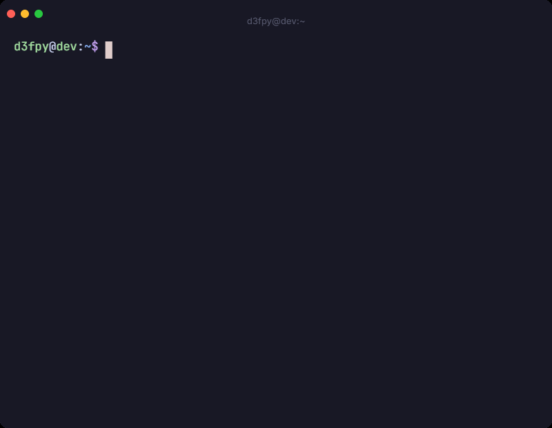

<div align="center">


### Python • Backend • FastAPI


</div>

<p align="center">
  
</p>

---

## About Me

```
╭──────────────────────────────────────────────╮
│                                              │
│  14-year-old self-taught developer           │
│                                              │
│  I like:                                     │
│                                              │
│   • Python                                   │
│   • Reverse Engineering                      │
│   • Linux Applications                       │
│   • C, C# and etc                            │
│   • Some cybersecurity                       │
│   • Love computers and internet              │
│                                              │
╰──────────────────────────────────────────────╯
```

---

## GitHub Stats

<p align="center">
  
  
</p>

<p align="center">
  
</p>

<p align="center">
  
</p>
---

## Terminal

<p align="center">
  
</p>

<!--
  Generated with tapegif (https://tapegif.mimrgrowthlab.com/)
  PROMPT: d3fpy @ dev : ~
  SCRIPT:
  $ whoami
  d3fpy
  $ uvicorn main:app --reload
  INFO:     Uvicorn running on http://127.0.0.1:8000
  $ docker compose up -d
  ✔ Container postgres_db  Started
  ✔ Container fastapi_app  Started
  $ gcc hello.c -o hello
  $ ./hello
  Hello user!
  $ echo "where coding meets insomnia"
  3am. anywhere.
  Upload the exported GIF to your repo (e.g. assets/terminal.gif) and update the src above.
-->

---


## Contribution Snake


